# 🔗 FC-005 CUSTOMER MANAGEMENT - INTEGRATION POINTS

**Datum:** 26.07.2025  
**Version:** 1.0  
**Kritikalität:** Hoch - Customer ist zentrale Entity  

## 📋 Inhaltsverzeichnis

1. [Übersicht der Integrationen](#übersicht-der-integrationen)
2. [M4 Opportunity Pipeline](#m4-opportunity-pipeline)
3. [FC-012 Audit Trail](#fc-012-audit-trail)
4. [Security & Permissions](#security--permissions)
5. [FC-009 Contract Management](#fc-009-contract-management)
6. [FC-003 Email Integration](#fc-003-email-integration)
7. [Event System](#event-system)
8. [API Gateway Pattern](#api-gateway-pattern)

---

## Übersicht der Integrationen

```mermaid
graph TB
    subgraph "Customer Management"
        CM[Customer Module]
        CE[Customer Events]
        CA[Customer API]
    end
    
    subgraph "Abhängige Module"
        M4[M4 Opportunity Pipeline]
        AT[FC-012 Audit Trail]
        CT[FC-009 Contracts]
        EM[FC-003 Email]
        AC[FC-013 Activities]
    end
    
    subgraph "Core Services"
        SEC[Security Service]
        EV[Event Bus]
        VAL[Validation Service]
    end
    
    CM --> CE
    CE --> EV
    
    M4 --> CA
    CT --> CA
    EM --> CA
    AC --> CA
    
    CM --> AT
    CM --> SEC
    CM --> VAL
    
    EV --> M4
    EV --> CT
    EV --> EM
```



---

## M4 Opportunity Pipeline

### Datenabhängigkeiten

```typescript
// Customer → Opportunity Relationship
interface OpportunityCustomerData {
  customerId: UUID;
  companyName: string;          // Cached from Customer
  industry: string;             // Cached from Customer
  contactName: string;          // Primary contact
  contactEmail: string;
  contactPhone: string;
  chainCustomer: boolean;       // Affects opportunity scoring
  locationCount?: number;       // For multi-location deals
}
```

### API Integration

```java
// In OpportunityService.java
@Inject
CustomerService customerService;

public OpportunityResponse createOpportunity(CreateOpportunityRequest request) {
    // Validate customer exists and is active
    Customer customer = customerService.getActiveCustomer(request.getCustomerId())
        .orElseThrow(() -> new CustomerNotFoundException(request.getCustomerId()));
    
    // Cache relevant customer data
    opportunity.setCompanyName(customer.getFieldValue("companyName"));
    opportunity.setIndustry(customer.getFieldValue("industry"));
    
    // Special handling for chain customers
    if ("ja".equals(customer.getFieldValue("chainCustomer"))) {
        opportunity.setPotentialValue(
            calculateChainCustomerPotential(customer)
        );
    }
}
```

### Event Handling

```java
// OpportunityEventHandler.java
public void onCustomerUpdated(@Observes CustomerUpdatedEvent event) {
    // Update cached customer data in opportunities
    List<Opportunity> opportunities = opportunityRepository
        .findActiveByCustomerId(event.getCustomerId());
        
    for (Opportunity opp : opportunities) {
        if (event.getChangedFields().containsKey("companyName")) {
            opp.setCompanyName(event.getChangedFields().get("companyName"));
        }
        // ... update other cached fields
    }
}
```

---

## FC-012 Audit Trail

### Audit Points

```java
// CustomerService.java - Audit Integration
@Inject
AuditService auditService;

private void auditCustomerCreation(Customer customer) {
    Map<String, Object> details = new HashMap<>();
    details.put("companyName", customer.getFieldValue("companyName"));
    details.put("industry", customer.getFieldValue("industry"));
    details.put("status", customer.getStatus());
    
    auditService.logCreation(
        AuditEntityType.CUSTOMER,
        customer.getId(),
        "Customer created",
        details
    );
}

private void auditFieldChange(
    UUID customerId,
    String fieldKey,
    Object oldValue,
    Object newValue
) {
    // Critical fields need detailed audit
    Set<String> criticalFields = Set.of(
        "companyName", 
        "legalForm", 
        "creditLimit",
        "paymentTerms"
    );
    
    AuditLevel level = criticalFields.contains(fieldKey) 
        ? AuditLevel.CRITICAL 
        : AuditLevel.NORMAL;
        
    auditService.logUpdate(
        AuditEntityType.CUSTOMER,
        customerId,
        String.format("Field '%s' changed", fieldKey),
        Map.of(
            "field", fieldKey,
            "oldValue", oldValue,
            "newValue", newValue,
            "level", level
        )
    );
}
```

### Frontend Audit Display

```typescript
// CustomerAuditTrail.tsx
export const CustomerAuditTrail: React.FC<{ customerId: string }> = ({ customerId }) => {
  const { data: auditEntries } = useQuery({
    queryKey: ['audit', 'customer', customerId],
    queryFn: () => auditApi.getAuditTrail({
      entityType: 'CUSTOMER',
      entityId: customerId
    })
  });
  
  return (
    <Timeline>
      {auditEntries?.map(entry => (
        <TimelineItem key={entry.id}>
          <TimelineContent>
            <Typography variant="h6">{entry.action}</Typography>
            <Typography variant="body2">
              {entry.userName} - {formatDate(entry.timestamp)}
            </Typography>
            {entry.details?.field && (
              <FieldChangeDisplay
                field={entry.details.field}
                oldValue={entry.details.oldValue}
                newValue={entry.details.newValue}
              />
            )}
          </TimelineContent>
        </TimelineItem>
      ))}
    </Timeline>
  );
};
```

---

## Security & Permissions

### Role-Based Access

```java
// CustomerSecurityService.java
@ApplicationScoped
public class CustomerSecurityService {
    
    @Inject
    SecurityContext securityContext;
    
    @Inject
    UserCustomerAssignmentRepository assignmentRepo;
    
    public boolean canViewCustomer(UUID customerId) {
        if (securityContext.isUserInRole("admin")) {
            return true;
        }
        
        if (securityContext.isUserInRole("manager")) {
            // Managers can see all customers in their region/team
            return isCustomerInUserScope(customerId);
        }
        
        if (securityContext.isUserInRole("sales")) {
            // Sales can only see assigned customers
            return assignmentRepo.isUserAssignedToCustomer(
                getCurrentUserId(), 
                customerId
            );
        }
        
        return false;
    }
    
    public boolean canEditCustomer(UUID customerId) {
        if (!canViewCustomer(customerId)) {
            return false;
        }
        
        // Additional checks for edit permissions
        Customer customer = customerRepository.findById(customerId).orElse(null);
        if (customer == null) return false;
        
        // Only admin can edit archived customers
        if (customer.getStatus() == CustomerStatus.ARCHIVED) {
            return securityContext.isUserInRole("admin");
        }
        
        return true;
    }
    
    public Set<String> getEditableFields(UUID customerId) {
        Set<String> editableFields = new HashSet<>();
        
        if (securityContext.isUserInRole("admin")) {
            // Admin can edit all fields
            return Set.of("*");
        }
        
        // Base fields everyone can edit
        editableFields.addAll(Set.of(
            "contactName", "contactEmail", "contactPhone",
            "notes", "customField1", "customField2"
        ));
        
        if (securityContext.isUserInRole("manager")) {
            // Managers can also edit
            editableFields.addAll(Set.of(
                "expectedVolume", "paymentMethod",
                "creditLimit", "industry"
            ));
        }
        
        return editableFields;
    }
}
```

### Frontend Permission Checks

```typescript
// hooks/useCustomerPermissions.ts
export const useCustomerPermissions = (customerId?: string) => {
  const { user } = useAuth();
  
  const { data: permissions } = useQuery({
    queryKey: ['permissions', 'customer', customerId],
    queryFn: () => customerApi.getPermissions(customerId!),
    enabled: !!customerId
  });
  
  return {
    canView: permissions?.canView ?? false,
    canEdit: permissions?.canEdit ?? false,
    canDelete: permissions?.canDelete ?? false,
    canChangeStatus: permissions?.canChangeStatus ?? false,
    editableFields: permissions?.editableFields ?? [],
    
    // Helper functions
    isFieldEditable: (fieldKey: string) => {
      if (!permissions?.editableFields) return false;
      return permissions.editableFields.includes('*') 
        || permissions.editableFields.includes(fieldKey);
    }
  };
};

// Usage in component
const CustomerField: React.FC<{ fieldKey: string }> = ({ fieldKey }) => {
  const { customerId } = useParams();
  const { isFieldEditable } = useCustomerPermissions(customerId);
  
  return (
    <TextField
      disabled={!isFieldEditable(fieldKey)}
      // ... other props
    />
  );
};
```

---

## FC-009 Contract Management

### Customer-Contract Relationship

```java
// Contract.java
@Entity
public class Contract extends BaseEntity {
    @ManyToOne(fetch = FetchType.LAZY)
    @JoinColumn(name = "customer_id", nullable = false)
    private Customer customer;
    
    // Cached customer data for performance
    @Column(name = "company_name")
    private String companyName;
    
    @Column(name = "customer_number")
    private String customerNumber;
}
```

### Contract Creation from Customer

```typescript
// CreateContractFromCustomer.tsx
export const CreateContractFromCustomer: React.FC<{ customerId: string }> = ({ 
  customerId 
}) => {
  const { data: customer } = useCustomer(customerId);
  const navigate = useNavigate();
  
  const handleCreateContract = () => {
    // Pre-fill contract with customer data
    const contractDefaults = {
      customerId: customer.id,
      companyName: customer.fieldValues.companyName,
      billingAddress: {
        street: customer.fieldValues.street,
        postalCode: customer.fieldValues.postalCode,
        city: customer.fieldValues.city
      },
      contactPerson: {
        name: customer.fieldValues.contactName,
        email: customer.fieldValues.contactEmail,
        phone: customer.fieldValues.contactPhone
      }
    };
    
    // Navigate to contract creation with defaults
    navigate('/contracts/new', { 
      state: { defaults: contractDefaults } 
    });
  };
  
  return (
    <Button 
      onClick={handleCreateContract}
      startIcon={<AddIcon />}
    >
      Neuen Vertrag erstellen
    </Button>
  );
};
```

---

## FC-003 Email Integration

### Email Context from Customer

```java
// EmailTemplateContext.java
public class CustomerEmailContext {
    private final Customer customer;
    private final Map<String, Object> fieldValues;
    
    public Map<String, Object> buildContext() {
        Map<String, Object> context = new HashMap<>();
        
        // Basic fields
        context.put("companyName", fieldValues.get("companyName"));
        context.put("contactName", fieldValues.get("contactName"));
        context.put("industry", fieldValues.get("industry"));
        
        // Computed fields
        context.put("salutation", buildSalutation());
        context.put("isChainCustomer", "ja".equals(fieldValues.get("chainCustomer")));
        
        // Location information
        if (context.get("isChainCustomer")) {
            context.put("locationCount", customer.getLocations().size());
            context.put("locations", buildLocationList());
        }
        
        return context;
    }
}
```

### Email Quick Actions

```typescript
// CustomerEmailActions.tsx
export const CustomerEmailActions: React.FC<{ customer: Customer }> = ({ 
  customer 
}) => {
  const { sendEmail } = useEmailIntegration();
  
  const emailTemplates = [
    {
      id: 'welcome',
      label: 'Willkommens-Email',
      template: 'customer.welcome',
      enabled: customer.status === 'ACTIVE'
    },
    {
      id: 'followup',
      label: 'Follow-up',
      template: 'customer.followup',
      enabled: true
    }
  ];
  
  const handleSendEmail = async (templateId: string) => {
    await sendEmail({
      templateId,
      recipientEmail: customer.fieldValues.contactEmail,
      context: {
        customerId: customer.id,
        customerType: 'CUSTOMER'
      }
    });
  };
  
  return (
    <ButtonGroup>
      {emailTemplates
        .filter(t => t.enabled)
        .map(template => (
          <Button
            key={template.id}
            onClick={() => handleSendEmail(template.id)}
          >
            {template.label}
          </Button>
        ))}
    </ButtonGroup>
  );
};
```

---

## Event System

### Domain Events

```java
// Customer Events
public class CustomerCreatedEvent extends DomainEvent {
    private final UUID customerId;
    private final String companyName;
    private final String industry;
    private final boolean isChainCustomer;
}

public class CustomerStatusChangedEvent extends DomainEvent {
    private final UUID customerId;
    private final CustomerStatus oldStatus;
    private final CustomerStatus newStatus;
}

public class CustomerFieldUpdatedEvent extends DomainEvent {
    private final UUID customerId;
    private final String fieldKey;
    private final Object oldValue;
    private final Object newValue;
}

public class LocationAddedEvent extends DomainEvent {
    private final UUID customerId;
    private final UUID locationId;
    private final String locationType;
}
```

### Event Publishers

```java
@ApplicationScoped
public class CustomerEventPublisher {
    
    @Inject
    Event<DomainEvent> eventBus;
    
    public void publishCustomerCreated(Customer customer) {
        Map<String, Object> fieldValues = getFieldValuesAsMap(customer);
        
        eventBus.fire(new CustomerCreatedEvent(
            customer.getId(),
            (String) fieldValues.get("companyName"),
            (String) fieldValues.get("industry"),
            "ja".equals(fieldValues.get("chainCustomer"))
        ));
    }
    
    public void publishFieldUpdate(
        UUID customerId,
        String fieldKey,
        Object oldValue,
        Object newValue
    ) {
        // Only publish for significant fields
        Set<String> significantFields = Set.of(
            "companyName", "industry", "chainCustomer",
            "creditLimit", "paymentTerms", "status"
        );
        
        if (significantFields.contains(fieldKey)) {
            eventBus.fire(new CustomerFieldUpdatedEvent(
                customerId, fieldKey, oldValue, newValue
            ));
        }
    }
}
```

### Event Subscribers

```java
// In verschiedenen Services
@ApplicationScoped
public class OpportunityCustomerEventHandler {
    
    @Inject
    OpportunityRepository opportunityRepository;
    
    public void onCustomerStatusChanged(
        @Observes CustomerStatusChangedEvent event
    ) {
        if (event.getNewStatus() == CustomerStatus.INACTIVE) {
            // Pause all opportunities for inactive customers
            List<Opportunity> opportunities = opportunityRepository
                .findActiveByCustomerId(event.getCustomerId());
                
            opportunities.forEach(opp -> {
                opp.setStatus(OpportunityStatus.ON_HOLD);
                opp.setHoldReason("Customer inactive");
            });
        }
    }
}
```

---

## API Gateway Pattern

### Customer Aggregate API

```java
@Path("/api/customer-aggregate")
public class CustomerAggregateResource {
    
    @Inject
    CustomerService customerService;
    
    @Inject
    OpportunityService opportunityService;
    
    @Inject
    ContractService contractService;
    
    @Inject
    ActivityService activityService;
    
    @GET
    @Path("/{customerId}/complete")
    public CustomerAggregateResponse getCompleteCustomer(
        @PathParam("customerId") UUID customerId
    ) {
        // Parallel data fetching
        CompletableFuture<Customer> customerFuture = 
            CompletableFuture.supplyAsync(() -> 
                customerService.getCustomer(customerId)
            );
            
        CompletableFuture<List<Opportunity>> opportunitiesFuture = 
            CompletableFuture.supplyAsync(() -> 
                opportunityService.findByCustomer(customerId)
            );
            
        CompletableFuture<List<Contract>> contractsFuture = 
            CompletableFuture.supplyAsync(() -> 
                contractService.findByCustomer(customerId)
            );
            
        CompletableFuture<List<Activity>> activitiesFuture = 
            CompletableFuture.supplyAsync(() -> 
                activityService.findRecentByCustomer(customerId, 10)
            );
        
        // Wait for all futures
        CompletableFuture.allOf(
            customerFuture, 
            opportunitiesFuture, 
            contractsFuture, 
            activitiesFuture
        ).join();
        
        // Build aggregate response
        return CustomerAggregateResponse.builder()
            .customer(customerFuture.join())
            .opportunities(opportunitiesFuture.join())
            .contracts(contractsFuture.join())
            .recentActivities(activitiesFuture.join())
            .statistics(calculateStatistics())
            .build();
    }
}
```

### Frontend Aggregate Hook

```typescript
// hooks/useCustomerAggregate.ts
export const useCustomerAggregate = (customerId: string) => {
  return useQuery({
    queryKey: ['customerAggregate', customerId],
    queryFn: () => customerApi.getCustomerAggregate(customerId),
    staleTime: 30 * 1000, // 30 seconds
    cacheTime: 5 * 60 * 1000, // 5 minutes
    select: (data) => ({
      ...data,
      // Computed values
      totalOpportunityValue: data.opportunities.reduce(
        (sum, opp) => sum + opp.value, 
        0
      ),
      activeContracts: data.contracts.filter(
        c => c.status === 'ACTIVE'
      ).length,
      lastActivity: data.recentActivities[0]?.timestamp
    })
  });
};
```

---

## Abhängigkeitsmatrix

| Modul | Liest Customer | Schreibt Customer | Events | Kritikalität |
|-------|---------------|------------------|---------|--------------|
| M4 Opportunity | ✓ | - | Subscribed | Hoch |
| FC-012 Audit | - | - | Publisher | Mittel |
| FC-009 Contract | ✓ | - | Subscribed | Hoch |
| FC-003 Email | ✓ | - | - | Niedrig |
| FC-013 Activity | ✓ | - | Subscribed | Mittel |
| FC-011 Cockpit | ✓ | - | - | Mittel |
| Security | ✓ | - | - | Hoch |

---

## Best Practices für Integration

1. **Caching**: Kritische Customer-Daten in abhängigen Modulen cachen
2. **Events**: Nur signifikante Änderungen publizieren
3. **Permissions**: Immer Security Service für Zugriff nutzen
4. **Aggregate API**: Für komplexe Views nutzen statt N+1 Queries
5. **Soft References**: UUIDs statt harte FK-Beziehungen für Entkopplung