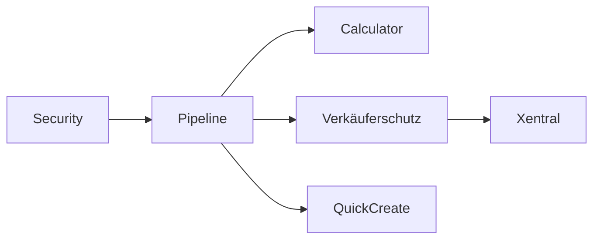

# 🎯 FINALE Optimierte Arbeitsreihenfolge - Alle Features

**Erstellt:** 12.07.2025  
**Status:** Endgültige Sequenz unter Berücksichtigung ALLER Features  
**Prinzipien:** Abhängigkeiten → Quick Wins → Funktionale Vollständigkeit → Business Value

## 🚨 Korrektur der Reihenfolge

Nach nochmaliger Analyse muss die Reihenfolge angepasst werden:

### ❌ **FALSCH:** Calculator vor Opportunity Pipeline
### ✅ **RICHTIG:** Opportunity Pipeline MUSS zuerst kommen!

## 📋 OPTIMIERTE SEQUENZ

### 🔥 **WOCHE 1: Foundation & Quick Wins**

#### Tag 1: Security Foundation (1 Tag)
```typescript
// Blockiert ALLES - muss zuerst!
1. Keycloak Login/Logout (0.5 Tag)
2. JWT Security Context Backend (0.5 Tag)
```
**Output:** Alle APIs secured, User-Context verfügbar

#### Tag 2-5: Opportunity Pipeline (4 Tage)
```typescript
// Das HERZSTÜCK - ohne das macht nichts Sinn!
3. Opportunity Entity & API (1 Tag)
4. Pipeline UI mit Drag&Drop (2 Tage)
5. Stage-Validierung & Rules (1 Tag)
```
**Output:** Funktionsfähige Pipeline, Basis für Calculator

---

### 🚀 **WOCHE 2: Process Integration**

#### Tag 6: Calculator Integration (1 Tag)
```typescript
// JETZT macht Calculator Sinn - als Modal in Pipeline!
6. Calculator Modal in Stage "Angebot"
7. Context-Passing von Opportunity
```
**Output:** Vollständiger Angebotsprozess

#### Tag 7-8: Verkäuferschutz Basis (2 Tage)
```typescript
// Muss früh rein - betrifft alle Sales-Daten!
8. Opportunity Ownership Rules
9. Basis-Provisionslogik
10. Schutz-Stufen Implementation
```
**Output:** Faire Verteilung, Provisions-Basis

#### Tag 9-10: Quick-Create Integration (2 Tage)
```typescript
// Jetzt sinnvoll - wir haben Entities zum Erstellen!
11. Quick-Create für Opportunities
12. Quick-Create für Kunden
13. Kontextuelle Aktionen
```
**Output:** Schnelle Dateneingabe

---

### 💬 **WOCHE 3-4: Communication Layer**

#### Tag 11-15: E-Mail Integration (5 Tage)
```typescript
// Hoher Business Value - #1 Schmerzpunkt!
14. OAuth2 Setup (1 Tag)
15. BCC-to-CRM Implementation (2 Tage)
16. Triage-Inbox (1 Tag)
17. E-Mail Timeline (1 Tag)
```
**Output:** Vollständige E-Mail-Historie

#### Tag 16-18: Team-Kommunikation (3 Tage)
```typescript
18. Chat-System pro Kunde/Opportunity
19. @mentions & Notifications
20. Activity Feed Integration
```
**Output:** Team-Kollaboration aktiv

---

### 📊 **WOCHE 5-6: Analytics & Insights**

#### Tag 19-22: Chef-Dashboard (4 Tage)
```typescript
// Führungskräfte brauchen Überblick!
21. Pipeline-Metriken API
22. Live Sales Monitor UI
23. KPI Widgets
24. WebSocket Integration
```
**Output:** Real-time Führungs-Dashboard

#### Tag 23-25: Customer Management Refactor (3 Tage)
```typescript
// Jetzt angehen - mit allen Integrationen!
25. MUI Migration
26. Legacy CSS Removal
27. Performance Optimierung
```
**Output:** Modernes Customer Module

---

### 🔧 **WOCHE 7-8: Integration Phase**

#### Tag 26-30: Xentral Integration (5 Tage)
```typescript
// Provisions-Management komplett!
28. API Integration
29. Webhook Setup
30. Provisions-Berechnung
31. Sync-Dashboard
```
**Output:** Automatische Provisionen

#### Tag 31-33: Basis-Integrationen (3 Tage)
```typescript
32. Google Calendar Deep-Sync
33. Anruf-Integration (Click-to-Call)
34. Bonitätsprüfung API
```
**Output:** Erweiterte Funktionalität

---

### 📱 **MONAT 2: Mobile & Advanced Features**

#### Woche 9-10: Mobile App (10 Tage)
```typescript
35. PWA Grundgerüst
36. Offline-Sync
37. Voice-to-Text
38. Visitenkarten-Scanner
```

#### Woche 11-12: KI Features (10 Tage)
```typescript
39. Lead Scoring
40. Next Best Action
41. E-Mail-Vorschläge
42. Deal-Prognosen
```

---

### 🎮 **MONAT 3: Excellence & Scale**

#### Weitere Features in Priorität:
- M6 Embedded Analytics (5 Tage)
- Gamification System (5 Tage)
- Advanced Security/2FA (3 Tage)
- DevOps & Monitoring (5 Tage)
- Externe Integrationen (Monday, Klenty) (5 Tage)
- Dark Mode (2 Tage)
- Backup & Recovery (3 Tage)

## 🎯 WARUM DIESE REIHENFOLGE?

### 1. **Abhängigkeiten respektiert:**


### 2. **Quick Wins maximiert:**
- **Tag 1:** Security ✅
- **Woche 1:** Demo-fähige Pipeline ✅
- **Woche 2:** Vollständiger Sales-Prozess ✅
- **Monat 1:** Produktiv einsetzbar ✅

### 3. **Business Value priorisiert:**
1. Sales-Prozess (Pipeline + Calculator)
2. Fairness (Verkäuferschutz)
3. Effizienz (E-Mail, Quick-Create)
4. Insights (Dashboard, Analytics)
5. Skalierung (Mobile, KI)

### 4. **Technisches Risiko minimiert:**
- Security zuerst (keine Nacharbeit)
- Legacy (M5) später (wenn System stabil)
- Neue Features vor Refactoring
- Integrationen nach Core

## 📊 Meilenstein-Übersicht

| Zeitpunkt | Was ist fertig | Business Value |
|-----------|----------------|----------------|
| Tag 1 | Security komplett | Basis geschaffen |
| Woche 1 | Opportunity Pipeline | Sales-Prozess live |
| Woche 2 | Calculator + Verkäuferschutz | Fairness & Effizienz |
| Woche 4 | E-Mail + Team-Komm | Kommunikation integriert |
| Monat 1 | Dashboard + Customer | **VOLLSTÄNDIG PRODUKTIV** |
| Monat 2 | Mobile + Basis-KI | Moderne Features |
| Monat 3 | Alle Features | **MARKTFÜHREND** |

## ✅ Diese Reihenfolge ist optimal weil:

1. **Keine Blockaden:** Security → Pipeline → Rest
2. **Immer demo-fähig:** Nach jeder Woche zeigbare Features
3. **Business-getrieben:** Verkäufer profitieren sofort
4. **Flexibel:** Nach Monat 1 kann neu priorisiert werden
5. **Vollständig:** ALLE besprochenen Features enthalten

## 🚀 EMPFEHLUNG: START MORGEN MIT TAG 1!

Keycloak-Integration (2 Funktionen) → Dann direkt Opportunity Pipeline!