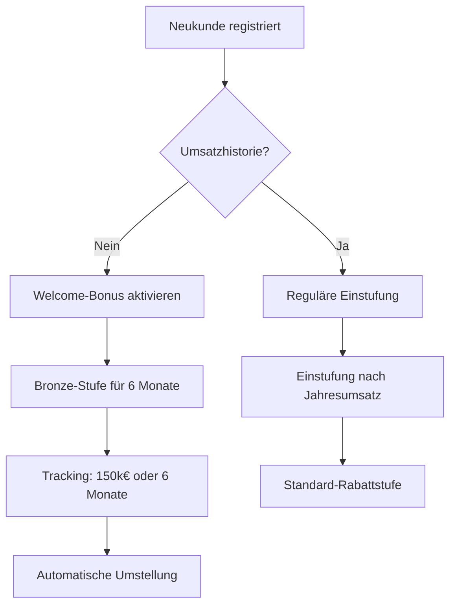
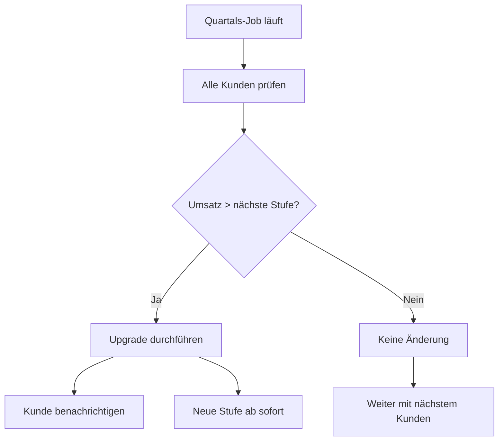
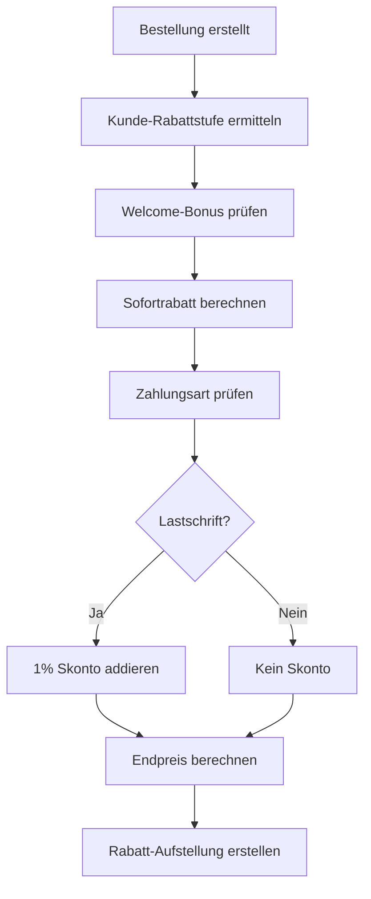

# 💼 Business Logic Standards - FreshPlan Geschäftsregeln

**Erstellt:** 2025-09-17
**Status:** ✅ Verbindlich ab 01.10.2025
**Quelle:** Konsolidierung aus /docs/business/ + Vertriebshilfe
**Scope:** Core Business Rules + Rabattsystem + AGB-Standards

## 📊 Executive Summary: Foundation Business Logic

### **NEUE RABATTLOGIK (Ab 01.10.2025):**
```yaml
Fundamentaler Systemwechsel:
  ❌ ENTFÄLLT: Calculator-basierte Bestellwert-Rabatte
  ❌ ENTFÄLLT: Vorlaufzeit-Rabatte (Frühbucher)
  ❌ ENTFÄLLT: Pickup-Rabatt
  ❌ ENTFÄLLT: Partnerschaftsvereinbarung

  ✅ NEU: Jahresumsatz-basierte Rabattstufen (2-10%)
  ✅ NEU: Rückvergütungssystem als Jahresbonus (1-5%)
  ✅ NEU: Welcome-Bonus für Neukunden (6 Monate)
  ✅ NEU: Skonto bei Lastschrift (1%)
  ✅ NEU: Nur noch AGBs (keine Partnerschaftsvereinbarung)
```

## 🎯 **RABATSSTUFEN-SYSTEM (Core Business Logic)**

### **Jahresumsatz-basierte Rabattstufen:**

| Jahresumsatz (netto) | Rabattstufe | Sofortrabatt |
|---------------------|-------------|--------------|
| < 25.000 € | **Einstieg** | 2% |
| 25.000 € – 99.999 € | **Bronze** | 4% |
| 100.000 € – 249.999 € | **Silber** | 6% |
| 250.000 € – 499.999 € | **Gold** | 8% |
| 500.000 € – 999.999 € | **Platin** | 9% |
| ab 1.000.000 € | **Enterprise** | 10% |

### **Business Rules:**
```yaml
Grundregeln:
  - Mindestbestellwert: 300€ (Startphase: kulant)
  - Basis: Netto-Jahresumsatz laufendes Jahr
  - Sofortrabatt: Auf Listenpreis jeder Bestellung

Upgrade-Logik:
  - Prüfung: Quartalsweise automatisch
  - Sofort-Upgrade: Bei deutlicher Schwellenüberschreitung
  - Gültigkeit: Ab nächster Bestellung

Downgrade-Logik:
  - Prüfung: Nur jährlich zum 01.01.
  - Kulanz: Bei knapper Unterschreitung möglich
  - Vorwarnung: 3 Monate vor Jahresende
```

## 💰 **RÜCKVERGÜTUNGSSYSTEM (Jahresbonus)**

### **Zusätzlicher Jahresbonus:**

| Jahresumsatz (nach Rabatt) | Rückvergütung |
|---------------------------|---------------|
| 25.000 € – 99.999 € | 1% |
| 100.000 € – 249.999 € | 2% |
| 250.000 € – 499.999 € | 3% |
| 500.000 € – 999.999 € | 4% |
| ab 1.000.000 € | 5% |

### **Auszahlungs-Logik:**
```yaml
Berechnung:
  - Basis: Nettoumsatz NACH Abzug aller Rabatte
  - Zeitraum: Geschäftsjahr (01.01. - 31.12.)
  - Auszahlung: Nach Geschäftsjahresabschluss

Verfahren:
  - Gutschrift oder Verrechnung mit offenen Posten
  - Automatische Berechnung im System
  - Kunde erhält detaillierte Aufstellung
```

## 🎁 **WELCOME-BONUS (Neukunden-Förderung)**

### **Neukunden-Logik:**
```yaml
Berechtigung:
  - Status: Neukunde ohne Umsatzhistorie
  - Start: Vorläufige Einstufung in nächsthöhere Rabattstufe

Gültigkeitsdauer:
  - 6 Monate ab erster Bestellung ODER
  - Maximal 150.000€ Umsatz
  - Was zuerst eintritt

Automatismen:
  - Benachrichtigung bei 80% Grenze erreicht
  - Automatische Umstellung auf reale Rabattstufe
  - Nahtloser Übergang ohne Systemunterbrechung
```

### **Beispiel-Logik:**
```
Neukunde ohne Historie:
├── Standard: Einstieg (2%)
├── Welcome-Bonus: Bronze (4%)
└── Nach 6 Monaten: Einstufung nach realem Umsatz
```

## 💳 **SKONTO-SYSTEM**

### **Zahlungsart-basierte Rabatte:**
```yaml
Skonto-Regeln:
  - 1% Skonto bei Zahlung per Lastschrift
  - 0% Skonto bei Rechnungszahlung
  - Additiv zu allen anderen Rabatten
  - Automatische Berechnung im System
```

## 🔧 **TECHNISCHE SERVICES-ARCHITEKTUR**

### **Neue Core Services (Required):**

#### **1. RabatsstufenService:**
```java
@ApplicationScoped
public class RabatsstufenService {
    // Automatische Quartals-Upgrades
    public void pruefeRabatsstufenUpgrade(Customer customer);

    // Jahresumsatz-Tracking
    public BigDecimal berechneJahresumsatz(Customer customer);

    // Rabattstufen-Ermittlung
    public RabattStufe ermittleAktuelleRabattstufe(Customer customer);
}
```

#### **2. WelcomeBonusService:**
```java
@ApplicationScoped
public class WelcomeBonusService {
    // Welcome-Bonus Status prüfen
    public boolean istWelcomeBonusBerechtigt(Customer customer);

    // Bonus-Ablauf überwachen
    public void pruefeWelcomeBonusAblauf(Customer customer);

    // 80% Warnung
    public void sendeBonusAblaufWarnung(Customer customer);
}
```

#### **3. RueckvergutungsService:**
```java
@ApplicationScoped
public class RueckvergutungsService {
    // Jahres-Rückvergütung berechnen
    public BigDecimal berechneJahresRueckvergutung(Customer customer);

    // Batch-Verarbeitung Jahresende
    public void verarbeiteJahresRueckvergutungen();
}
```

#### **4. PricingCalculatorService (NEU):**
```java
@ApplicationScoped
public class PricingCalculatorService {
    // Komplette Preis-Berechnung
    public PriceCalculationResult berechneEndpreis(
        Order order,
        Customer customer,
        PaymentMethod paymentMethod
    );

    // Rabatt-Breakdown für Transparenz
    public RabattBreakdown erstelleRabattAufstellung(Order order);
}
```

### **Obsolete Services (zu entfernen):**
```java
❌ LegacyCalculatorService       // Bestellwert-basiert
❌ VorlaufzeitRabattService     // Frühbucher-System
❌ PickupRabattService          // Abholrabatt
❌ PartnerschaftsService        // Partnerschaftsvereinbarung
```

## 📋 **AGB & RECHTSGRUNDLAGEN**

### **Gültige Dokumente:**
```yaml
✅ AKTUELL GÜLTIG:
  - AGBs FreshFoodz (neueste Version)
  - Neue Rabattlogik 2025 (ab 01.10.2025)
  - Datenschutzerklärung

❌ NICHT MEHR GÜLTIG:
  - FreshPlan-Partnerschaftsvereinbarung
  - Anlage 1: Altes Rabattsystem für Endkunden
  - Calculator-basierte Verträge
```

### **AGB-Kernpunkte (für System-Integration):**
```yaml
Zahlungsbedingungen:
  - Zahlungsziel: 14 Tage netto
  - Skonto: 1% bei Lastschrift
  - Verzug: Nach 14 Tagen automatisch

Lieferbedingungen:
  - Mindestbestellwert: 300€
  - Lieferzeit: Standardlieferung
  - Versandkosten: Nach Vereinbarung

Stornobedingungen:
  - Storno bis 24h vor Lieferung möglich
  - Danach nur nach Absprache
  - Bearbeitungsgebühr möglich
```

## 🔄 **BUSINESS LOGIC WORKFLOWS**

### **Neukundenregistrierung:**


### **Quartalsweise Upgrade-Prüfung:**


### **Bestellpreis-Berechnung:**


## 📊 **REPORTING & KPIs**

### **Business Intelligence Requirements:**
```yaml
Rabattstufen-Reporting:
  - Verteilung Kunden pro Rabattstufe
  - Umsatzentwicklung pro Stufe
  - Upgrade/Downgrade-Trends

Welcome-Bonus-Tracking:
  - Anzahl aktive Welcome-Bonuses
  - Conversion-Rate nach Bonus-Ende
  - Umsatzimpact von Neukunden-Förderung

Rückvergütungs-Controlling:
  - Gesamtsumme Rückvergütungen
  - Durchschnittliche Rückvergütung pro Kunde
  - ROI von Rückvergütungsprogramm
```

## 🚨 **SONDERFÄLLE & ESKALATION**

### **Key Accounts & Einkaufszentralen:**
```yaml
Sonderbehandlung:
  - Individuelle Preisverhandlungen möglich
  - Rahmenvereinbarungen
  - Separate Konditionsmodelle

Eskalationspfad:
  - Nur auf explizite Nachfrage anbieten
  - Interne Abstimmung mit Jörg Streeck
  - Keine automatisierten Angebote
```

### **Alternative Modelle:**
```yaml
Bei Bedarf verfügbar:
  - Mengenbonus pro Bestellung
  - Volumenrabatte für Großabnehmer
  - Projektspezifische Kondtionen

Freigabeprozess:
  - Management-Approval erforderlich
  - Dokumentation der Sonderkonditionen
  - Zeitliche Befristung empfohlen
```

## 📈 **MIGRATION & IMPLEMENTATION**

### **Clean Slate Advantage:**
```yaml
Vorteil:
  - Noch keine Live-Kunden im System
  - Keine Migration alter Daten nötig
  - Direkter Start mit neuem System

Implementierung:
  - Core Services entwickeln
  - Neue Business Logic komplett implementieren
  - Alte Calculator-Logic deaktivieren
```

### **Go-Live Strategie:**
```yaml
Phase 1 (bis 01.10.2025):
  - Neue Services implementieren
  - Core Business Logic testen
  - UI für Rabattstufen-Management

Phase 2 (ab 01.10.2025):
  - Neues System aktivieren
  - Alle Neukunden automatisch
  - Monitoring & Fine-Tuning

Phase 3 (Q4 2025):
  - Erste Quartals-Upgrades
  - Optimierung basierend auf echten Daten
  - Reporting & Analytics ausbauen
```

## 🔍 **VALIDATION & TESTING**

### **Business Logic Tests:**
```yaml
Unit Tests:
  - Rabattstufen-Berechnung
  - Welcome-Bonus-Logik
  - Preis-Kalkulation
  - Skonto-Berechnung

Integration Tests:
  - End-to-End Bestellprozess
  - Quartals-Upgrade-Workflow
  - Rückvergütungs-Berechnung

Business Tests:
  - Beispielrechnungen validieren
  - Edge Cases testen
  - Performance mit großen Datenmengen
```

---

**📋 Business Logic Standards basiert auf:** Rabattlogik 2025 NEU + AGB FreshFoodz + Technical Requirements
**📅 Gültig ab:** 01.10.2025
**👨‍💻 Business Owner:** Jörg Streeck + Sales Team

**🎯 Diese Standards definieren die verbindliche Business Logic für alle FreshPlan Features!**