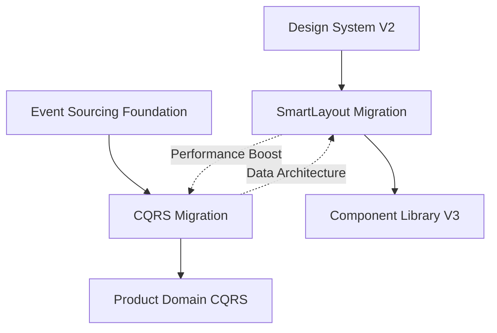

# 🏗️ Infrastructure Master Index

**Zweck:** Zentrale Übersicht aller Infrastruktur-Migrationspläne und deren Status
**Owner:** Development Team + Claude
**Letztes Update:** 2025-09-18

## 📊 **AKTIVE INFRASTRUKTUR-PLÄNE**

| Plan | Status | Owner | Timeline | Effort | Priorität |
|------|--------|-------|----------|---------|-----------|
| [Test Debt Recovery](./TEST_DEBT_RECOVERY_PLAN.md) | 🔴 Critical | QA + Dev Team | Q4 2025 → Q1 2026 | L | 🔥 Kritisch |
| [SmartLayout Migration](./SMARTLAYOUT_MIGRATION_PLAN.md) | 🔄 In Progress | Frontend Team | Q4 2025 → Q1 2026 | M | 🔥 Hoch |
| [CQRS Migration](./CQRS_MIGRATION_PLAN.md) | 🟡 Review | Backend Team | Q4 2025 → Q2 2026 | L | 🟠 Medium |
| [Performance Optimization](./PERFORMANCE_OPTIMIZATION_PLAN.md) | 🟡 Review | Performance Team | Q4 2025 → Q2 2026 | M | 🟠 Medium |
| [Component Library V3](./COMPONENT_LIBRARY_V3_MIGRATION_PLAN.md) | 🔄 In Progress | Frontend Team | Q4 2025 → Q1 2026 | S | 🟡 Low |
| [Security Hardening](./SECURITY_HARDENING_PLAN.md) | 🟡 Review | Security Team | Q1 2026 → Q2 2026 | M | 🟠 Medium |
| [Business Logic Modernization](./BUSINESS_LOGIC_MODERNIZATION_PLAN.md) | 🔵 Draft | Business Team | Q1 2026 → Q2 2026 | S | 🟡 Low |
| [Development Workflow Enhancement](./DEVELOPMENT_WORKFLOW_ENHANCEMENT_PLAN.md) | 🔵 Draft | DevOps Team | Q1 2026 | XS | 🟡 Low |

## 🎯 **INFRASTRUKTUR-ROADMAP 2025-2026**

### **Q4 2025 (Aktuell)**
**Focus:** Frontend Layout-Modernisierung + Backend Performance-Foundation

- ✅ **SmartLayout Migration - Phase 1** (Woche 1-4)
  - SmartLayout Core Implementation
  - Content-Type-Detection-Logic
  - Pilot mit 5 kritischen Seiten

- 🟡 **CQRS Migration - Foundation** (Woche 1-8)
  - Command/Query-Handler-Infrastructure
  - Customer-Domain als Pilot
  - Feature-Flag-basierte Migration

### **Q1 2026**
**Focus:** Full SmartLayout Rollout + CQRS Customer-Domain

- 🔄 **SmartLayout Migration - Phases 2-4**
  - Vollständige Migration aller 23 Komponenten
  - Performance-Optimierungen
  - MainLayoutV2 Removal

- 🔄 **CQRS Migration - Customer-Domain**
  - CustomerReadModel Implementation
  - Performance-Benchmarking
  - Production-Ready Monitoring

### **Q2 2026**
**Focus:** CQRS Order-Domain + Advanced Features

- 📋 **CQRS Migration - Order-Domain**
  - Complex Business-Logic Migration
  - Cross-Domain-Queries
  - Read-Model-Caching mit Redis

## 📋 **DEPENDENCY MATRIX**

**Kritische Dependencies:**
- SmartLayout → Design System V2 completion erforderlich
- CQRS → Event Sourcing Foundation muss implementiert sein
- Beide Pläne → Performance Standards als Benchmark-Basis

## 🚨 **RISK ASSESSMENT**

### **SmartLayout Migration**
- **Risk:** Content-Type-Detection-Accuracy <95%
- **Impact:** Manual Fallbacks erforderlich
- **Mitigation:** Extensive Testing mit Real-World-Content

### **CQRS Migration**
- **Risk:** Event-Synchronization-Latency >10ms
- **Impact:** Inconsistent Read-Models
- **Mitigation:** Event-Bus-Monitoring und Automated-Recovery

## 📈 **SUCCESS METRICS OVERVIEW**

### **Combined Infrastructure KPIs:**
- **Page-Load-Performance:** Target <200ms P95 (Combined SmartLayout + CQRS)
- **Developer-Productivity:** Target -50% Configuration-Time
- **System-Scalability:** Target 10x mehr Concurrent-Users
- **Maintenance-Overhead:** Target -30% durch Automation

### **Q4 2025 Milestones:**
- [ ] SmartLayout Core funktional (Woche 4)
- [ ] CQRS Customer-Pilot live (Woche 8)
- [ ] Performance-Benchmarks etabliert
- [ ] Team Training abgeschlossen

### **Q1 2026 Milestones:**
- [ ] SmartLayout 100% Migration complete
- [ ] CQRS Customer-Domain production-ready
- [ ] Legacy-Code-Removal durchgeführt
- [ ] Documentation und Best-Practices finalisiert

## 🔗 **RELATED DOCUMENTATION**

**Foundation Knowledge:**
- **Design System:** → [../grundlagen/DESIGN_SYSTEM.md](../grundlagen/DESIGN_SYSTEM.md)
- **API Standards:** → [../grundlagen/API_STANDARDS.md](../grundlagen/API_STANDARDS.md)
- **Performance Guidelines:** → [../grundlagen/PERFORMANCE_STANDARDS.md](../grundlagen/PERFORMANCE_STANDARDS.md)

**Architecture Foundation:**
- **Event Sourcing:** → [../architektur/EVENT_SOURCING_FOUNDATION.md](../architektur/EVENT_SOURCING_FOUNDATION.md)
- **Module Integration:** → [../architektur/MODULE_INTEGRATION_MAP.md](../architektur/MODULE_INTEGRATION_MAP.md)

**Feature Context:**
- **Active Features:** → [../features/](../features/)
- **Component Library:** → [../grundlagen/COMPONENT_LIBRARY.md](../grundlagen/COMPONENT_LIBRARY.md)

## 🤖 **CLAUDE HANDOVER für Infrastructure**

**Für nächsten Claude:**

**Aktueller Infrastruktur-Stand:**
Zwei kritische Migration-Pläne erstellt und strukturiert nach PLANUNGSMETHODIK. SmartLayout ist in Progress, CQRS in Review-Phase.

**Nächste konkrete Aktionen:**
1. SmartLayout Migration Phase 1 starten - React Component Implementation
2. CQRS Foundation Review abschließen - Event-Bus-Architecture finalisieren
3. Cross-Plan Koordination - Performance-Benchmarks etablieren

**Wichtige Koordinations-Punkte:**
- SmartLayout und CQRS haben Performance-Synergien die genutzt werden sollten
- Event-Bus aus CQRS kann später für SmartLayout-Analytics verwendet werden
- Timeline-Alignment wichtig: Q1 2026 beide Pläne parallel aktiv

**Master-Plan-Integration:**
Beide Infrastruktur-Pläne sind im [CRM_COMPLETE_MASTER_PLAN.md](../../CRM_COMPLETE_MASTER_PLAN.md) referenziert und ergänzen die Feature-Development-Roadmap.

**Qualitäts-Check:**
✅ Beide Pläne folgen PLANUNGSMETHODIK (300-400 Zeilen, Executive Summary, 4 Phasen)
✅ Cross-References etabliert zu Foundation-Dokumenten
✅ Claude Handover Sections für Kontinuität
✅ Konkrete Success-Metrics definiert