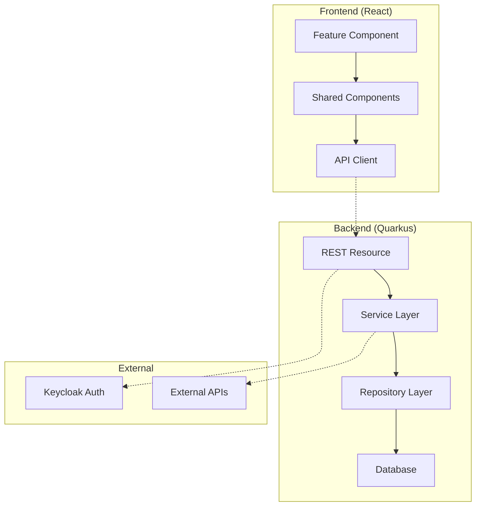

# FC-XXX: [Feature Name] - Technisches Konzept

**Feature-Code:** FC-XXX
**Erstellt:** [YYYY-MM-DD]
**Status:** 🟡 Draft / 🔵 Review / 🟠 Approved / 🟢 In Progress / ✅ Done
**Autor:** [Name]
**Reviewer:** [Name]
**Kategorie:** [Mein Cockpit / Neukundengewinnung / Kundenmanagement / etc.]
**Priorität:** 🚀 High / 📋 Medium / 🔄 Low

## 📋 Inhaltsverzeichnis

1. [Zusammenfassung](#zusammenfassung)
2. [Business Context](#business-context)
3. [Technische Architektur](#technische-architektur)
4. [Backend-Implementierung](#backend-implementierung)
5. [Frontend-Implementierung](#frontend-implementierung)
6. [Testing Strategy](#testing-strategy)
7. [Implementierungsstrategie](#implementierungsstrategie)
8. [Performance & Security](#performance--security)
9. [Risiken und Mitigationen](#risiken-und-mitigationen)
10. [Entscheidungs-Log](#entscheidungs-log)

## 📝 Zusammenfassung

[Kurze Beschreibung des Features in 2-3 Sätzen. Was macht es? Warum ist es wichtig?]

**Geschäftswert:** [Welchen konkreten Nutzen bringt es?]
**Technischer Scope:** [Was wird technisch umgesetzt?]

## 🎯 Business Context

### Problem Statement
- **Problem:** [Welches konkrete Problem löst dieses Feature?]
- **Kontext:** [In welchem Nutzungskontext tritt das Problem auf?]
- **Impact:** [Welche Auswirkungen hat das Problem aktuell?]

### User Stories
```
Als [Rolle]
möchte ich [Funktionalität]
damit ich [Nutzen/Ziel erreiche]

Akzeptanzkriterien:
- [ ] [Kriterium 1]
- [ ] [Kriterium 2]
- [ ] [Kriterium 3]
```

### Geschäftsziele
- **[Ziel 1]**: [Beschreibung und messbarer Nutzen]
- **[Ziel 2]**: [Beschreibung und messbarer Nutzen]
- **[Ziel 3]**: [Beschreibung und messbarer Nutzen]

### Success Criteria
- [ ] **Funktional:** [Was muss funktionieren?]
- [ ] **Performance:** [Welche Performance-Anforderungen?]
- [ ] **UX:** [Welche User Experience wird erwartet?]
- [ ] **Business:** [Welche Business-Metriken werden verbessert?]

## 🏗️ Technische Architektur

### System-Übersicht



### Required Foundation Components
- [ ] **Component Library:** [Welche UI-Komponenten werden benötigt?]
- [ ] **API Standards:** [Welche API-Patterns werden verwendet?]
- [ ] **Authentication:** [Welche Auth-Requirements gibt es?]
- [ ] **Database:** [Welche DB-Änderungen sind nötig?]

### Komponenten-Interaktion
[Beschreibung des Datenflusses und der Interaktionen zwischen den Komponenten]

## 🔧 Backend-Implementierung

### 1. API Endpoints

#### Neue Endpoints
```yaml
# REST API Design
POST /api/v1/[resource]           # Create
GET  /api/v1/[resource]           # List (with pagination)
GET  /api/v1/[resource]/{id}      # Get by ID
PUT  /api/v1/[resource]/{id}      # Update
DELETE /api/v1/[resource]/{id}    # Delete
```

#### Authorization
```java
// Required Roles/Permissions
@RolesAllowed({"admin", "manager", "user"})
@PermissionsAllowed("resource:read")
```

### 2. Datenmodell

#### Entity Design
```java
@Entity
@Table(name = "feature_entities")
public class FeatureEntity {
    @Id
    @GeneratedValue(strategy = GenerationType.UUID)
    private UUID id;

    // Business fields
    @Column(nullable = false)
    private String name;

    // Audit fields
    @CreationTimestamp
    private LocalDateTime createdAt;

    @UpdateTimestamp
    private LocalDateTime updatedAt;
}
```

#### DTOs
```java
// Request DTOs
public record CreateFeatureRequest(
    @NotBlank String name,
    @Valid SubRequest subField
) {}

// Response DTOs
public record FeatureResponse(
    UUID id,
    String name,
    LocalDateTime createdAt
) {}
```

### 3. Business Logic
```java
@ApplicationScoped
@Transactional
public class FeatureService {

    // Constructor injection
    private final FeatureRepository repository;
    private final FeatureMapper mapper;

    public FeatureResponse createFeature(CreateFeatureRequest request) {
        // 1. Validation
        // 2. Business Rules
        // 3. Persistence
        // 4. Response Mapping
    }
}
```

### 4. Datenbank-Änderungen

#### Migration Script
```sql
-- V1.X__create_feature_table.sql
CREATE TABLE feature_entities (
    id UUID PRIMARY KEY DEFAULT gen_random_uuid(),
    name VARCHAR(255) NOT NULL,
    created_at TIMESTAMP DEFAULT CURRENT_TIMESTAMP,
    updated_at TIMESTAMP DEFAULT CURRENT_TIMESTAMP
);

CREATE INDEX idx_feature_name ON feature_entities(name);
```

## 🎨 Frontend-Implementierung

### 1. Komponenten-Struktur

```typescript
// Feature-based structure
features/
├── [feature]/
│   ├── components/
│   │   ├── FeatureList.tsx
│   │   ├── FeatureForm.tsx
│   │   └── FeatureCard.tsx
│   ├── hooks/
│   │   └── useFeatureApi.ts
│   ├── services/
│   │   └── featureApi.ts
│   ├── types/
│   │   └── feature.types.ts
│   └── utils/
│       └── featureUtils.ts
```

### 2. Hauptkomponente
```typescript
interface FeatureComponentProps {
  variant?: 'primary' | 'secondary';
  onAction?: (data: FeatureData) => void;
}

export const FeatureComponent: React.FC<FeatureComponentProps> = ({
  variant = 'primary',
  onAction
}) => {
  const theme = useTheme();
  const { data, loading, error } = useFeatureApi();

  // Implementation using theme colors (NO hardcoded values!)
  const styles = {
    container: {
      backgroundColor: theme.palette.background.paper,
      color: theme.palette.text.primary,
    }
  };

  return (
    <Box sx={styles.container}>
      {/* Component implementation */}
    </Box>
  );
};
```

### 3. State Management
- **React Query:** Server state management
- **Zustand:** Lokaler State (wenn nötig)
- **Context:** Cross-component state

### 4. API Integration
```typescript
// API Client with error handling
export const featureApi = {
  async getAll(params?: QueryParams): Promise<FeatureListResponse> {
    const response = await apiClient.get('/api/v1/features', { params });
    return response.data;
  },

  async create(data: CreateFeatureRequest): Promise<FeatureResponse> {
    const response = await apiClient.post('/api/v1/features', data);
    return response.data;
  }
};

// React Query hooks
export const useFeatures = (params?: QueryParams) => {
  return useQuery({
    queryKey: ['features', params],
    queryFn: () => featureApi.getAll(params),
    staleTime: 5 * 60 * 1000, // 5 minutes
  });
};
```

## 🧪 Testing Strategy

### Test Coverage Ziele
- [ ] **Unit Tests:** >80% Coverage für Business Logic
- [ ] **Integration Tests:** 100% API Endpoints
- [ ] **Component Tests:** Alle UI Components
- [ ] **E2E Tests:** Kritische User Journeys

### Backend Tests
```java
@QuarkusTest
class FeatureServiceTest {
    @Test
    void shouldCreateFeature() {
        // Given
        var request = new CreateFeatureRequest("test");

        // When
        var result = featureService.create(request);

        // Then
        assertThat(result.getName()).isEqualTo("test");
    }
}
```

### Frontend Tests
```typescript
describe('FeatureComponent', () => {
  it('should render with theme colors', () => {
    render(<FeatureComponent />);

    const component = screen.getByTestId('feature-component');
    expect(component).toHaveStyle({
      backgroundColor: theme.palette.background.paper
    });
  });
});
```

### E2E Tests
```typescript
test('should manage features end-to-end', async ({ page }) => {
  await page.goto('/features');
  await page.click('[data-testid="create-button"]');
  await page.fill('[data-testid="name-input"]', 'Test Feature');
  await page.click('[data-testid="submit-button"]');

  await expect(page.locator('[data-testid="feature-list"]'))
    .toContainText('Test Feature');
});
```

## 🚀 Implementierungsstrategie

### Phase 1: Foundation & Backend ([X] Tage)

#### Sprint 1.1: Database & Entity Model ([X] Tage)
1. **Tag 1**: Database Migration, Entity Design
2. **Tag 2**: Repository Layer, Unit Tests

#### Sprint 1.2: API Layer ([X] Tage)
1. **Tag 1**: REST Resources, DTO Mapping
2. **Tag 2**: Integration Tests, API Documentation

### Phase 2: Frontend & Integration ([X] Tage)

#### Sprint 2.1: UI Components ([X] Tage)
1. **Tag 1**: Basic Components mit Theme Integration
2. **Tag 2**: Component Tests, Storybook Stories

#### Sprint 2.2: State Management & API Integration ([X] Tage)
1. **Tag 1**: React Query Setup, API Hooks
2. **Tag 2**: Error Handling, Loading States

### Phase 3: Testing & Polish ([X] Tage)

#### Sprint 3.1: End-to-End Testing ([X] Tage)
1. **Tag 1**: E2E Test Scenarios
2. **Tag 2**: Performance Testing

#### Sprint 3.2: Final Integration ([X] Tage)
1. **Tag 1**: Security Review, Accessibility
2. **Tag 2**: Documentation, Deployment

## ⚡ Performance & Security

### Performance Targets
- **API Response Time:** < 200ms P95
- **Frontend Render:** < 100ms First Contentful Paint
- **Bundle Size Impact:** < 50KB additional
- **Database Queries:** Optimiert, keine N+1 Probleme

### Security Considerations
- [ ] **Input Validation:** Server-side validation aller Inputs
- [ ] **Authorization:** Role-based access control
- [ ] **CSRF Protection:** Für state-changing operations
- [ ] **XSS Prevention:** Input sanitization, output encoding

### Optimization Strategies
- [ ] **Lazy Loading:** Komponenten und Daten
- [ ] **Caching:** React Query + Backend Caching
- [ ] **Pagination:** Für Listen mit vielen Einträgen
- [ ] **Memoization:** Für teure Berechnungen

## ⚠️ Risiken und Mitigationen

### Risiko 1: Performance bei großen Datenmengen
**Wahrscheinlichkeit:** Mittel
**Impact:** Hoch
**Mitigation:** Pagination, Indexierung, Lazy Loading implementieren

### Risiko 2: Theme Integration Konflikte
**Wahrscheinlichkeit:** Niedrig
**Impact:** Mittel
**Mitigation:** Strikte Verwendung von theme.palette, keine hardcoded Farben

### Risiko 3: API Breaking Changes
**Wahrscheinlichkeit:** Niedrig
**Impact:** Hoch
**Mitigation:** API Versioning, Backward Compatibility

## 📝 Entscheidungs-Log

### [YYYY-MM-DD] - Technology Stack
**Entscheidung:** React Query für Server State Management
**Begründung:** Bessere Caching-Strategien und Error Handling als Redux
**Impact:** Reduzierte Komplexität, bessere Performance
**Alternativen:** Redux Toolkit Query, SWR
**Entscheider:** [Name]

### [YYYY-MM-DD] - Database Schema Design
**Entscheidung:** UUID als Primary Key
**Begründung:** Bessere Skalierbarkeit und Security
**Impact:** Keine Sequential IDs, schwerer zu erraten
**Alternativen:** Auto-increment Integer IDs
**Entscheider:** [Name]

## 🔗 Code References

### Frontend
- **Hauptkomponente:** `/frontend/src/features/[feature]/`
- **Shared Components:** `/frontend/src/components/`
- **API Client:** `/frontend/src/services/api/`
- **Types:** `/frontend/src/types/`

### Backend
- **REST API:** `/backend/src/main/java/de/freshplan/[feature]/api/`
- **Business Logic:** `/backend/src/main/java/de/freshplan/[feature]/domain/service/`
- **Database:** `/backend/src/main/java/de/freshplan/[feature]/domain/entity/`
- **Migrations:** `/backend/src/main/resources/db/migration/`

### Tests
- **Frontend Tests:** `/frontend/src/features/[feature]/__tests__/`
- **Backend Tests:** `/backend/src/test/java/de/freshplan/[feature]/`
- **E2E Tests:** `/e2e/tests/[feature]/`

## 📊 Implementation Status

### Foundation
- [ ] **Component Library:** 🟡 Vorbereitung / 🔵 In Arbeit / 🟢 Fertig
- [ ] **API Standards:** 🟡 Vorbereitung / 🔵 In Arbeit / 🟢 Fertig
- [ ] **Database Schema:** 🟡 Vorbereitung / 🔵 In Arbeit / 🟢 Fertig

### Backend
- [ ] **Entity Model:** 🟡 Vorbereitung / 🔵 In Arbeit / 🟢 Fertig
- [ ] **Repository Layer:** 🟡 Vorbereitung / 🔵 In Arbeit / 🟢 Fertig
- [ ] **Service Layer:** 🟡 Vorbereitung / 🔵 In Arbeit / 🟢 Fertig
- [ ] **REST API:** 🟡 Vorbereitung / 🔵 In Arbeit / 🟢 Fertig

### Frontend
- [ ] **Components:** 🟡 Vorbereitung / 🔵 In Arbeit / 🟢 Fertig
- [ ] **State Management:** 🟡 Vorbereitung / 🔵 In Arbeit / 🟢 Fertig
- [ ] **API Integration:** 🟡 Vorbereitung / 🔵 In Arbeit / 🟢 Fertig
- [ ] **Theme Integration:** 🟡 Vorbereitung / 🔵 In Arbeit / 🟢 Fertig

### Testing
- [ ] **Unit Tests:** 🟡 Vorbereitung / 🔵 In Arbeit / 🟢 Fertig
- [ ] **Integration Tests:** 🟡 Vorbereitung / 🔵 In Arbeit / 🟢 Fertig
- [ ] **E2E Tests:** 🟡 Vorbereitung / 🔵 In Arbeit / 🟢 Fertig

## ⏱️ Zeitschätzung

**Gesamt-Aufwand**: [X-Y] Tage

- **Backend**: [X] Tage
  - Entity & Repository: [X] Tage
  - Service Layer: [X] Tage
  - REST API: [X] Tage
- **Frontend**: [X] Tage
  - Components: [X] Tage
  - State Management: [X] Tage
  - Integration: [X] Tage
- **Testing**: [X] Tage
  - Unit Tests: [X] Tage
  - Integration Tests: [X] Tage
  - E2E Tests: [X] Tage
- **Documentation & Polish**: [X] Tage

**Puffer**: +[X] Tage für unvorhergesehene Probleme

---

**📋 Template verwendet:** FEATURE_TEMPLATE.md v2.0 (Konsolidiert)
**📅 Letzte Aktualisierung:** [YYYY-MM-DD]
**👨‍💻 Feature Owner:** [Team/Person]

**🎯 Dieses Dokument ist der Single Source of Truth für Feature FC-XXX**

**Status-Updates**:
- [Datum]: Konzept erstellt (Draft)
- [Datum]: Review durch [Name]
- [Datum]: [Status-Änderung]