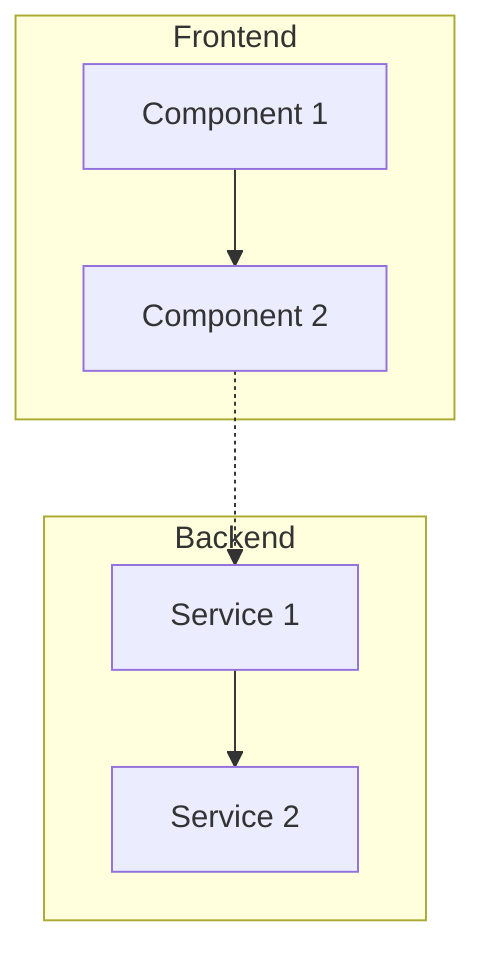

# FC-XXX: Technisches Konzept - [Feature Name]

**Feature Code:** FC-XXX  
**Datum:** [YYYY-MM-DD]  
**Status:** Draft | In Review | Approved | In Progress | Done  
**Autor:** [Name]  
**Reviewer:** [Name]  

## 📋 Inhaltsverzeichnis

1. [Zusammenfassung](#zusammenfassung)
2. [Ziel und Geschäftswert](#ziel-und-geschäftswert)
3. [Technische Architektur](#technische-architektur)
4. [Backend-Implementierung](#backend-implementierung)
5. [Frontend-Implementierung](#frontend-implementierung)
6. [Implementierungsstrategie](#implementierungsstrategie)
7. [Entscheidungs-Log](#entscheidungs-log)
8. [Risiken und Mitigationen](#risiken-und-mitigationen)
9. [Zeitschätzung](#zeitschätzung)

## Zusammenfassung

[Kurze Beschreibung des Features in 2-3 Sätzen. Was macht es? Warum ist es wichtig?]

## Ziel und Geschäftswert

### Geschäftsziele
- **[Ziel 1]**: [Beschreibung und messbarer Nutzen]
- **[Ziel 2]**: [Beschreibung und messbarer Nutzen]
- **[Ziel 3]**: [Beschreibung und messbarer Nutzen]

### Technische Ziele
- **[Ziel 1]**: [z.B. Performance-Ziele, Skalierbarkeit]
- **[Ziel 2]**: [z.B. Wartbarkeit, Erweiterbarkeit]
- **[Ziel 3]**: [z.B. Security, Compliance]

## Technische Architektur

### System-Übersicht

### Komponenten-Interaktion

[Beschreibung des Datenflusses und der Interaktionen]

## Backend-Implementierung

### 1. API Endpoints

[Beschreibung der neuen/geänderten Endpoints]

### 2. Datenmodell

[Neue Entities, DTOs, Änderungen am Schema]

### 3. Business Logic

[Zentrale Geschäftslogik und Services]

### 4. Datenbank-Änderungen

[Migrations, Indizes, Performance-Überlegungen]

## Frontend-Implementierung

### 1. Komponenten-Struktur

[React-Komponenten und ihre Hierarchie]

### 2. State Management

[Zustand/Redux/Context Struktur]

### 3. UI/UX Design

[Mockups, Wireframes, Design-Entscheidungen]

### 4. Integration

[API-Calls, Error Handling, Loading States]

## Implementierungsstrategie

### Phase 1: [Name] ([X] Tage)

#### Sprint 1.1: [Beschreibung] ([X] Tage)
1. **Tag 1**: [Aufgaben]
2. **Tag 2**: [Aufgaben]

### Phase 2: [Name] ([X] Tage)

[Weitere Phasen...]

## Entscheidungs-Log

### [Datum] - [Entscheidung]
**Entscheidung**: [Was wurde entschieden]  
**Begründung**: [Warum]  
**Alternativen**: [Welche Alternativen wurden betrachtet]  
**Entscheider**: [Wer hat entschieden]

## Risiken und Mitigationen

### Risiko 1: [Beschreibung]
**Wahrscheinlichkeit**: Niedrig | Mittel | Hoch  
**Impact**: Niedrig | Mittel | Hoch  
**Mitigation**: [Wie wird das Risiko minimiert]

### Risiko 2: [Beschreibung]
[Weitere Risiken...]

## Zeitschätzung

**Gesamt-Aufwand**: [X-Y] Tage

- **Backend**: [X] Tage
- **Frontend**: [X] Tage  
- **Integration & Testing**: [X] Tage
- **Dokumentation**: [X] Tage

**Puffer**: +[X] Tage für unvorhergesehene Probleme

---

**Status-Updates**:
- [Datum]: Konzept erstellt (Draft)
- [Datum]: Review durch [Name]
- [Datum]: [Status-Änderung]