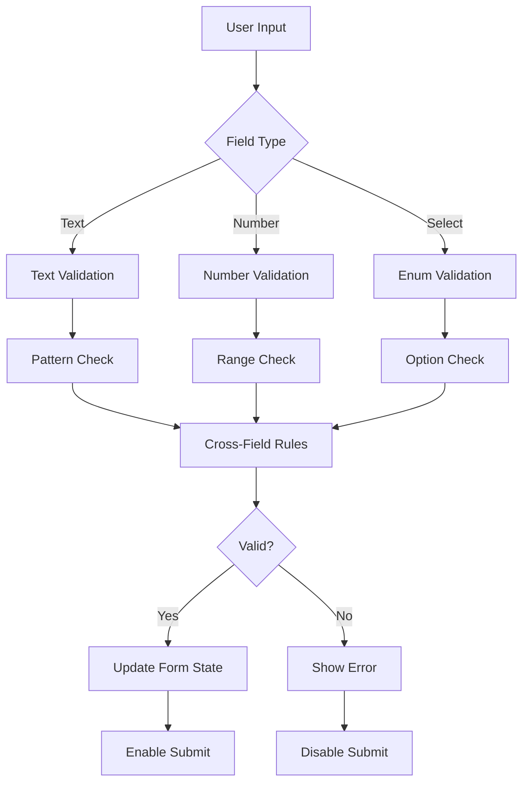

# Customer Management Validation System

**Stand:** 26.07.2025  
**Status:** ✅ Implementiert  
**Modul:** FC-005 Customer Management - Validation Layer

## 📋 Übersicht

Diese Validation-Schicht bietet ein umfassendes, typsicheres Validierungssystem für das Customer Management. Es kombiniert:

- **Zod Schemas** für deklarative Validierung
- **React Hook Form** Integration für Form-State Management
- **Dynamic Schema Building** basierend auf Field Definitions
- **Cross-Field Validation** für Geschäftsregeln
- **Industry-spezifische** Validierungen

## 🏗️ Architektur

### Validierungs-Struktur

```
validation/
├── baseSchemas.ts          # Wiederverwendbare Basis-Validierungen
├── customerSchemas.ts      # Customer-spezifische Schemas
├── locationSchemas.ts      # Location-spezifische Schemas
├── schemaBuilder.ts        # Dynamische Schema-Generierung
├── crossFieldValidation.ts # Multi-Field Geschäftsregeln
├── useFormValidation.ts    # React Hook Form Integration
├── index.ts               # Zentrale Exports
└── README.md              # Diese Datei
```

### Schema-Hierarchie

```
Base Schemas (Atomic)
    ↓
Entity Schemas (Domain-specific)
    ↓
Dynamic Schemas (Field-based)
    ↓
Form Validation (UI Layer)
```

## 🔧 Verwendung

### 1. Basis-Validierung mit vordefinierten Schemas

```typescript
import {
  useFormValidation,
  EntityType
} from '@/features/customers/validation';

// In Customer Form Component
const { form, validateField, errors, isValid } = useFormValidation({
  entityType: EntityType.CUSTOMER,
  industry: 'hotel',
  isDraft: false // Vollständige Validierung
});

// Form registrieren
<input
  {...form.register('companyName')}
  error={errors.companyName}
  onBlur={(e) => validateField('companyName', e.target.value)}
/>
```

### 2. Dynamische Validierung mit Field Definitions

```typescript
import { useFieldDefinitions } from '../hooks';
import { useFormValidation } from '../validation';

// Field Definitions laden
const { customerFields } = useFieldDefinitions();

// Dynamische Form-Validierung
const { form, errors } = useFormValidation({
  fields: customerFields,
  isDraft: true, // Erlaubt partielle Daten
  realtimeValidation: true,
  validationDelay: 500, // Debounce 500ms
});
```

### 3. Multi-Step Form Validierung

```typescript
import { useStepValidation } from '../validation';

// In Wizard Component
const { currentStep } = useCustomerOnboardingStore();
const { validateStep, canProceed } = useStepValidation(currentStep);

const handleNext = async () => {
  const { isValid, errors } = await validateStep();

  if (!isValid) {
    // Zeige Fehler an
    errors.forEach((message, field) => {
      toast.error(`${field}: ${message}`);
    });
    return;
  }

  // Weiter zum nächsten Schritt
  nextStep();
};
```

### 4. Cross-Field Validierung

```typescript
import { validateCustomerCrossFields } from '../validation';

// Validiere Geschäftsregeln
const validationResult = validateCustomerCrossFields(customerData, locations.length);

if (!validationResult.isValid) {
  // Zeige Fehler
  Object.entries(validationResult.errors!).forEach(([field, message]) => {
    setFieldError(field, message);
  });
}

// Zeige Warnungen (optional)
if (validationResult.warnings) {
  Object.entries(validationResult.warnings).forEach(([field, message]) => {
    toast.warning(message);
  });
}
```

## 📚 Validierungs-Regeln

### Deutsche Standards

- **PLZ:** Genau 5 Ziffern (`/^[0-9]{5}$/`)
- **Telefon:** 10-15 Ziffern, flexible Formatierung
- **E-Mail:** Standard E-Mail mit Lowercase-Normalisierung
- **IBAN:** DE + 20 Zeichen (vereinfacht)

### Geschäftsregeln

#### Hotels

- 5-Sterne Hotels: Min. 50 Zimmer
- Sterne-Kategorie: Pflichtfeld
- Restaurant-Kapazität: Abhängig von Sterne-Kategorie

#### Krankenhäuser

- Universitätskliniken: Min. 300 Betten
- Mindestens eine Abteilung
- Notaufnahme-Flag beeinflusst andere Felder

#### Ketten-Kunden

- Sollten mehrere Standorte haben
- Hauptstandort sollte vollständige Adresse haben

### Adress-Validierung

- Wenn ein Adressfeld ausgefüllt → Alle müssen ausgefüllt sein
- Hauptstandort benötigt vollständige Adresse
- PLZ-Validierung gegen deutsche Standards

## 🚀 Performance-Optimierungen

### 1. Schema Caching

```typescript
// schemaBuilder.ts
private schemaCache = new Map<string, z.ZodType<any>>();

// Schemas werden gecached nach field.key + field.version
```

### 2. Debounced Validation

```typescript
// Real-time Validierung mit Debouncing
const { validateField } = useFormValidation({
  realtimeValidation: true,
  validationDelay: 300, // 300ms delay
});
```

### 3. Lazy Schema Building

Schemas werden nur gebaut wenn benötigt, nicht bei jedem Render.

## 🧪 Testing

### Unit Tests für Schemas

```typescript
describe('Customer Schemas', () => {
  it('should validate hotel requirements', () => {
    const hotelData = {
      companyName: 'Grand Hotel',
      industry: 'hotel',
      chainCustomer: 'nein',
      starRating: '5',
      roomCount: 100,
    };

    const result = getCustomerSchema('hotel').safeParse(hotelData);
    expect(result.success).toBe(true);
  });
});
```

### Integration Tests

```typescript
describe('Form Validation Hook', () => {
  it('should validate draft incrementally', async () => {
    const { result } = renderHook(() =>
      useFormValidation({
        entityType: EntityType.CUSTOMER,
        isDraft: true,
      })
    );

    // Nur companyName ist required für drafts
    const isValid = await result.current.validateAll();
    expect(isValid).toBe(false);
    expect(result.current.errors.companyName).toBeDefined();
  });
});
```

## 📊 Validierungs-Flow



## 🔗 Integration Points

### Mit Zustand Store

```typescript
// Validation errors werden im Store gespeichert
const { validationErrors, setValidationError, clearValidationError } = useCustomerOnboardingStore();
```

### Mit API Services

```typescript
// Async Validation gegen Backend
const checkCompanyNameUnique = async (name: string) => {
  const response = await customerApi.checkCompanyName(name);
  return !response.exists;
};
```

### Mit Field Renderer

```typescript
// Field Components bekommen Validation State
<DynamicFieldRenderer
  field={field}
  value={value}
  onChange={handleChange}
  error={errors[field.key]}
  onBlur={() => validateField(field.key, value)}
/>
```

## ✅ Features

- [x] Zod Schema Integration
- [x] React Hook Form Support
- [x] Deutsche Validierungs-Standards
- [x] Industry-spezifische Regeln
- [x] Cross-Field Validation
- [x] Async Validation Support
- [x] Draft Mode (Partial Validation)
- [x] Real-time Validation mit Debouncing
- [x] TypeScript Type Safety
- [x] Performance Optimiert

## 📚 Weiterführende Dokumentation

- [Validation Konzept](/Users/joergstreeck/freshplan-sales-tool/docs/features/FC-005-CUSTOMER-MANAGEMENT/03-FRONTEND/04-validation.md)
- [Field System](/Users/joergstreeck/freshplan-sales-tool/docs/features/FC-005-CUSTOMER-MANAGEMENT/02-BACKEND/02-field-system.md)
- [Frontend Architecture](/Users/joergstreeck/freshplan-sales-tool/docs/features/FC-005-CUSTOMER-MANAGEMENT/03-FRONTEND/README.md)
- [Data Model](/Users/joergstreeck/freshplan-sales-tool/docs/features/FC-005-CUSTOMER-MANAGEMENT/01-TECH-CONCEPT/02-data-model.md)
